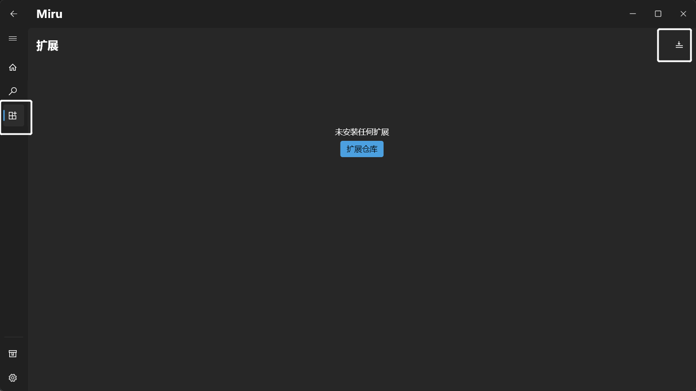
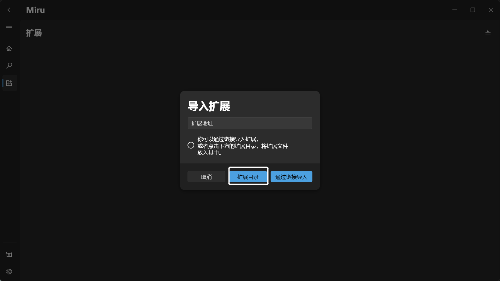

To develop extensions, you need to have a good understanding of JavaScript and regular expressions. If you are not familiar with regular expressions, you can start by learning "[Regular Expressions and String Methods](https://zh.javascript.info/regexp-methods)" and "[Regular Expressions in 30 Minutes](https://deerchao.net/tutorials/regex/regex.htm)".

This documentation assumes that you have already set up the development environment as described in the [Environment Setup](/en/developer/1-environment/) section.

## Quick Start

### Create Extension File

Please create a JavaScript file with the same name as your package name in the extension loading directory on Windows.

:::tip
You can navigate to the extension page by clicking on the extension loading directory:

Then click the import button in the upper right corne:

This will quickly locate the extension directory.
:::

### Write Metadata

The metadata contains basic information about the extension, such as the package name, version, author, description, etc. Write the metadata in the extension file, and it must be enclosed between `// ==MiruExtension==` comments.

Metadata example:

```text

// ==MiruExtension==
// @name  Extension Name
// @version v0.0.1
// @author Xxxx
// @lang zh-cn
// @icon https://xxx.xxx.xxx/xxx.png
// @package xxx.xxx.xxx
// @type bangumi
// @webSite https://xxx.xxx.xxx/
// ==/MiruExtension==

```

:::tip
The `@name`, `@version`, `@webSite`, `@package`, `@type` are required fields, while others are optional.
The `@webSite` is the target address of the extension, and the `@package`  must match the extension file name.

The `@type` is a required field used to indicate the type of the extension.
| @type | | |
| :-: | :-: | :-: |
| | bangumi | Animation |
| | manga| Manga |
| | fikushon | Novel |
:::

### Extends Extension Class

In the extension file, export a class that extends the `Extension` class. For example:

```javascript
export default class extends Extension {}
```

### Override Methods in the Extension

In the extension class, override the methods from the `Extension` class. For example:

```javascript
export default class extends Extension {
  async latest() {
    // Latest updates
  }
  async search() {
    // Search
  }
  async detail() {
    // Details
  }
  async watch() {
    // Watch
  }
}
```

The returned data should follow the [data format](/en/developer/3-data/).
You can use the `this.request` method to make requests, for example:

```javascript
const res = await this.request({
  url: "/xxx",
  method: "GET",
});
```

`this.request`  is a proxy request. If you don't use `this.request`, you may encounter cross-origin errors (Web only).

### Submit to the `Miru Extension Repository`

Please submit your extension to the `Miru Extension Repository` using `PR`. The submitted `PR` needs to contain your extension file and **does not need** the `index.json` file.

## Example

You can visit the [Miru Official Repository](https://miru-repo.0n0.dev) for examples.
